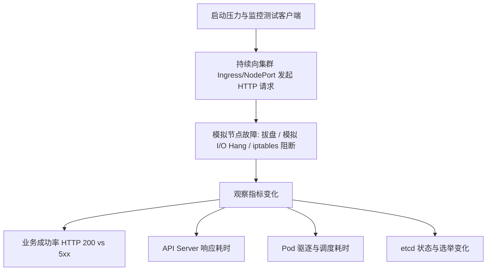
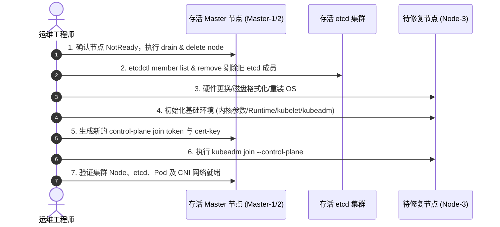

# 3 节点混合 K8s 集群（Master+Worker）单节点故障深度分析与重建修复实战指南

> **环境背景**：
> - **集群架构**：3 节点混合部署架构（3 Nodes, Stacked Control Plane + Worker，每个节点既是 Master/etcd 成员，又是 Worker 调度节点）。
> - **故障场景**：其中 1 个节点因底层磁盘故障（I/O Hang / 坏道 / 文件系统只读 / 损坏）导致节点状态变为 `NotReady`。
> - **核心目标**：评估业务影响与测试方案、制定标准重建/重新加入节点（Rejoin）修复流程、明确全局影响范围。

---

## 目录
1. [第一部分：对业务有无影响及测试验证方案](#第一部分对业务有无影响及测试验证方案)
2. [第二部分：故障节点重建与重新加入集群方案（SOP）](#第二部分故障节点重建与重新加入集群方案sop)
3. [第三部分：全维度故障影响范围评估](#第三部分全维度故障影响范围评估)
4. [生产运维与高可用优化建议](#生产运维与高可用优化建议)

---

## 第一部分：对业务有无影响及测试验证方案

在 3 节点堆叠控制面（Stacked Master+Worker）架构下，单节点宕机或处于 `NotReady` 状态对业务的影响可分为**控制面状态**和**数据/业务面状态**两个层面。

### 1. 业务影响深度剖析

#### (1) 控制面（etcd & API Server）层面：理论不断流，但进入容灾危险期
- **etcd Quorum 机制**：3 节点集群的法定票数法定人数为 $Q = \lfloor 3/2 \rfloor + 1 = 2$。当 1 节点挂掉后，剩余 2 个 etcd 节点仍满足 Quorum，**集群读写能力不受影响**，仍然可以执行 `kubectl`、创建/删除资源。
- **高可用瓶颈**：当前容错阈值为 $0$（Fault Tolerance = 0）。在此期间若再有 1 台节点出现异常，整个 etcd 集群将彻底丢失 Quorum，导致 API Server 只读甚至不可用。

#### (2) 业务数据面（Pods & Traffic）层面：取决于业务形态与调度策略
| 业务场景类型 | 故障时的即时影响 | 默认 300s 驱逐超时后的影响 | 潜在业务风险 |
| :--- | :--- | :--- | :--- |
| **无状态多副本 (Deployment $\ge 2$) 且配置了反亲和** | **影响极小**（剩余副本在另外 2 台节点继续承接流量） | 故障节点上的副本被判定死亡并在存活节点重建 | 若存活节点资源（CPU/内存）不足，新 Pod 会处于 `Pending` |
| **无状态单副本 (Deployment = 1)** | **业务中断**（流量无法到达挂掉的 Pod） | 300s 后控制器在健康节点重建 Pod，业务恢复 | 存在 **至少 5 分钟（300s）** 的业务不可用窗口 |
| **有状态服务（依赖本地磁盘 Local PV / HostPath）** | **业务持久中断** | 即使驱逐也无法在其他节点启动（PV 强绑定在故障节点） | 必须等待故障节点恢复或依赖底层数据备份重建 |
| **有状态服务（依赖共享存储 NFS/Ceph/云盘）** | **业务中断** | 300s 后重建，但可能因 VolumeAttachment 锁未释放产生 `Multi-Attach error` | 需要人工介入删除故障 Pod 或强制解挂存储 |
| **对外暴露入口 (Ingress / NodePort / LB)** | 若外部 LB **未配置**健康检查并轮询到了故障节点，会导致 **1/3 请求出现 502/Connection Refused** | 流量路由状态取决于外部 LB 的剔除机制 | 必须依赖四/七层健康检查实现故障节点秒级切流 |

---

### 2. 影响验证与测试方法（混沌/模拟测试方案）

为在测试/演练环境中验证故障对业务的影响，可采取以下验证测试步骤：



#### 测试验证步骤：
1. **流量探测注入**：
   使用压测或探测工具持续请求业务接口（如 `hey` / `k6` / `wrk`）：
   ```bash
   # 持续每秒发起 50 个请求并记录状态码
   hey -z 10m -q 50 -c 10 http://<业务域名或VIP>/healthz
   ```
2. **故障模拟（根据需要选择一种）**：
   - 方式 A（磁盘只读/满载）：`mount -o remount,ro /` 或对 kubelet 根目录制造 I/O 挂起。
   - 方式 B（断网隔离）：在故障节点执行 `iptables -F && iptables -A INPUT -j DROP`。
   - 方式 C（停掉组件）：`systemctl stop kubelet && docker/nerdctl stop $(docker/nerdctl ps -q)`。
3. **关键数据指标观测**：
   - **业务端**：记录是否有 HTTP 502/504 错误出现，持续时间多久。
   - **集群控制面**：
     ```bash
     kubectl get nodes -w
     kubectl get pods -A -o wide -w
     ```
   - **etcd 状态观测**：
     ```bash
     etcdctl --endpoints=https://127.0.0.1:2379 \
       --cacert=/etc/kubernetes/pki/etcd/ca.crt \
       --cert=/etc/kubernetes/pki/etcd/server.crt \
       --key=/etc/kubernetes/pki/etcd/server.key \
       endpoint health
     ```

---

## 第二部分：故障节点重建与重新加入集群方案（SOP）

由于故障原因是**底层磁盘问题**，通常需要格式化磁盘、更换硬件或重装操作系统。因此，**不能直接用原有的脏状态接入，必须先在集群中彻底清除旧节点及 etcd 成员信息，随后以全新节点身份加入**。

### 修复流程图


---

### 详细实战执行步骤

#### 步骤一：在存活的 Master 节点上清理旧节点与旧 etcd 成员（至关重要）

> [!WARNING]
> **切勿遗漏 etcd 成员清理！** 
> 如果只删除了 k8s node，但 etcd 里依然残留故障节点的 member ID，重新以同名加入时会导致 etcd 报错或集群 Quorum 异常。

1. **从 K8s 集群中删除故障节点**：
   ```bash
   # 标记不可调度并驱逐（如果节点已死，drain 可能会超时，可加参数强制）
   kubectl drain <faulty-node-name> --delete-emptydir-data --force --ignore-daemonsets --timeout=60s

   # 删除 Node 资源
   kubectl delete node <faulty-node-name>
   ```

2. **检查并剔除旧的 etcd 成员**：
   在存活的任意一台 Master 节点上登录进入 etcdctl（或通过 kube-apiserver 挂载证书）：
   ```bash
   # 定义 etcdctl 证书环境变量
   export ETCDCTL_API=3
   export ETCD_CERTS="--cacert=/etc/kubernetes/pki/etcd/ca.crt --cert=/etc/kubernetes/pki/etcd/server.crt --key=/etc/kubernetes/pki/etcd/server.key"

   # 1. 查看当前 etcd 成员列表
   etcdctl $ETCD_CERTS --endpoints=https://127.0.0.1:2379 member list -w table

   # 2. 找到故障节点对应的 ID (例如: a8b34c2190ef0123)，将其移除
   etcdctl $ETCD_CERTS --endpoints=https://127.0.0.1:2379 member remove <FAULTY_MEMBER_ID>

   # 3. 再次验证成员列表，确保只剩下存活的 2 个成员
   etcdctl $ETCD_CERTS --endpoints=https://127.0.0.1:2379 member list -w table
   ```

---

#### 步骤二：修复/重装故障节点机器

1. 更换坏盘、重新分区并挂载文件系统。
2. 重装操作系统（建议与另外两台保持完全相同的 OS 发行版和内核版本）。
3. 配置系统基础环境：
   ```bash
   # 禁用 Swap
   swapoff -a
   sed -i '/swap/s/^/#/' /etc/fstab

   # 加载内核模块
   cat <<EOF | tee /etc/modules-load.d/k8s.conf
   overlay
   br_netfilter
   EOF
   modprobe overlay
   modprobe br_netfilter

   # 配置 sysctl
   cat <<EOF | tee /etc/sysctl.d/k8s.conf
   net.bridge.bridge-nf-call-iptables  = 1
   net.bridge.bridge-nf-call-ip6tables = 1
   net.ipv4.ip_forward                 = 1
   EOF
   sysctl --system

   # 设置主机名与 hosts 解析（保持与之前或新规范一致）
   hostnamectl set-hostname <new-or-repaired-nodename>
   ```
4. 安装容器运行时（如 containerd）以及对应版本的 `kubelet`、`kubeadm`、`kubectl`（**版本必须与集群当前版本一致**）。

---

#### 步骤三：在存活 Master 上生成 Join 命令与证书密钥

由于该节点需要同时充当 **Master (Control Plane)** 和 **Worker**，加入时必须带有 `--control-plane` 标志和证书解密密钥。

1. **重新上传控制面证书并获取 key**：
   在存活的健康 Master 节点执行：
   ```bash
   kubeadm init phase upload-certs --upload-certs
   ```
   *控制台会输出一个 32 字节的字符串，例如：`[upload-certs] Using certificate key: 8f9b2c3d4e5f...`*

2. **生成加入命令与 Token**：
   ```bash
   kubeadm token create --print-join-command
   ```
   *输出示例：`kubeadm join <VIP_OR_APISERVER_IP>:6443 --token abcdef.0123456789abcdef --discovery-token-ca-cert-hash sha256:xxx...`*

3. **拼接完整的 Control-Plane Join 命令**：
   ```bash
   # 将步骤 1 的 certificate-key 附加到 join 命令后：
   kubeadm join <VIP_OR_APISERVER_IP>:6443 \
     --token <TOKEN> \
     --discovery-token-ca-cert-hash sha256:<HASH> \
     --control-plane \
     --certificate-key <CERTIFICATE_KEY>
   ```

---

#### 步骤四：在修复好的节点上执行加入与后置检查

1. **执行 Join 命令**：
   在修复节点执行步骤三拼接好的命令：
   ```bash
   kubeadm join <VIP_OR_APISERVER_IP>:6443 \
     --token <TOKEN> \
     --discovery-token-ca-cert-hash sha256:<HASH> \
     --control-plane \
     --certificate-key <CERTIFICATE_KEY>
   ```

2. **去除 Master 调度污点（如果之前该集群是 3 节点混合部署且允许跑业务 Pod）**：
   默认情况下，`kubeadm` 会为 Master 节点打上 `node-role.kubernetes.io/control-plane:NoSchedule` 污点。如果是 3 节点全功能混合集群，需要去除该污点以允许 Worker 负载调度：
   ```bash
   # 在任意 Master 执行
   kubectl taint nodes <node-name> node-role.kubernetes.io/control-plane:NoSchedule- || true
   kubectl taint nodes <node-name> node-role.kubernetes.io/master:NoSchedule- || true
   ```

3. **健康状态验收**：
   ```bash
   # 1. 检查节点状态是否为 Ready
   kubectl get nodes -o wide

   # 2. 检查静态控制面 Pods 与 CNI DaemonSet 是否正常运行
   kubectl get pods -n kube-system -o wide

   # 3. 检查 etcd 集群成员状态与 Endpoint 健康度
   etcdctl $ETCD_CERTS --endpoints=https://127.0.0.1:2379 endpoint health -w table
   etcdctl $ETCD_CERTS --endpoints=https://127.0.0.1:2379 member list -w table
   ```

---

## 第三部分：全维度故障影响范围评估

| 评估维度 | 故障期具体影响 | 风险级别 | 应对与缓解措施 |
| :--- | :--- | :--- | :--- |
| **集群仲裁 (etcd Quorum)** | 3 节点剩下 2 节点，集群暂时具备读写能力，但**容错能力降为 0**。若此时第二台节点再故障，集群将发生脑裂保护、全面瘫痪。 | 🔴 **高危** | 在 24 小时内尽快完成故障节点重加，缩短降级窗口。 |
| **算力与资源水位** | 集群总计算资源（CPU/Memory/GPU）瞬间**减少 33.3%**。 | 🟡 **中危** | 提前设定日常集群资源水位 $\le 60\%$；如资源紧张需临时降级非核心服务。 |
| **流量网关 (Ingress/SLB)** | 若外部 SLB 未配置主动健康检查，发往故障节点的请求会导致 TCP Reset / 超时。 | 🟠 **高危/中危** | 外部负载均衡必须配置针对 NodePort / Ingress 端口的 HTTP/TCP 探活机制。 |
| **集群内部 DNS (CoreDNS)** | 若 CoreDNS 副本数配置为 2 且其中一个恰好在故障节点上，单副本承受双倍解析压力。 | 🟡 **中危** | 确保 CoreDNS 正常运行，或使用 NodeLocal DNSCache 减少波动。 |
| **有状态存储 (PV/PVC)** | 1. 本地存储（Local PV/HostPath）数据直接离线，无法跨节点漂移。<br>2. 集中存储可能存在 Volume 锁争用。 | 🔴 **高危** | 核心数据务必使用网络共享存储或分布式中间件自带的多副本机制。 |
| **自动驱逐风暴 (Eviction)** | 5 分钟超时后，故障节点上的全部 Pod 集中在剩余 2 台节点并发拉起，可能导致容器镜像拉取压力、瞬间 CPU/IO 争抢。 | 🟡 **中危** | 预热常用基础镜像；合理配置 Pod 的 `requests` 和 `limits` 防止 OOM。 |

---

## 生产运维与高可用优化建议

1. **调整默认驱逐容忍时间（Toleration Seconds）**：
   K8s 默认对 `node.kubernetes.io/unreachable` 和 `node.kubernetes.io/not-ready` 的污点容忍时间为 300 秒（5分钟）。对于关键核心业务，可在 Deployment 中显式设置更短的容忍时间（如 30~60s）以加速故障自愈转移：
   ```yaml
   tolerations:
   - key: "node.kubernetes.io/not-ready"
     operator: "Exists"
     effect: "NoExecute"
     tolerationSeconds: 60
   - key: "node.kubernetes.io/unreachable"
     operator: "Exists"
     effect: "NoExecute"
     tolerationSeconds: 60
   ```

2. **配置 Pod 拓扑分布与反亲和（PodAntiAffinity）**：
   确保同一业务的多个副本分散在不同的物理节点上，避免单点故障造成服务不可用：
   ```yaml
   affinity:
     podAntiAffinity:
       preferredDuringSchedulingIgnoredDuringExecution:
       - weight: 100
         podAffinityTerm:
           labelSelector:
             matchExpressions:
             - key: app
               operator: In
               values: ["my-app"]
           topologyKey: "kubernetes.io/hostname"
   ```

3. **建设 etcd 自动备份机制**：
   小集群高可用容灾能力弱，必须配置 CronJob 每日定时备份 etcd Snapshot 至外部异地存储（如 S3 或专门的备份服务器）。
